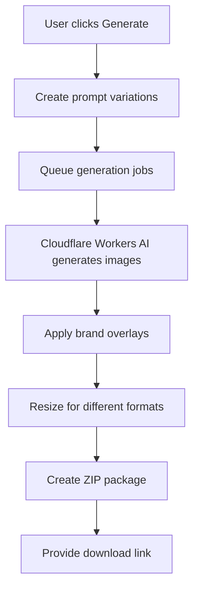

# Amway IBO Image Campaign Generator - Technical Development Document

## Project Overview

A simplified Cloudflare Workers-based application that allows Amway IBOs to input product URLs, configure brand preferences, and generate cohesive image campaigns using AI. The app scrapes product information and creates multiple branded images suitable for social media marketing.

## Core System Architecture

### Technology Stack
```
Frontend: Cloudflare Pages (React/Next.js)
Backend: Cloudflare Workers 
AI Generation: Cloudflare Workers AI (@cf/black-forest-labs/flux-1-schnell)
Storage: Cloudflare R2 (temporary file storage)
Database: Cloudflare D1 (user preferences, generation history)
Authentication: Cloudflare Access or simple JWT
```

### Cloudflare Workers AI Models Available
- **@cf/black-forest-labs/flux-1-schnell** - Fast image generation
- **@cf/meta/llama-2-7b-chat-fp16** - Text processing and prompt generation
- **@cf/microsoft/resnet-50** - Image analysis for style matching

## User Workflow

### Step 1: URL Input & Product Scraping


**Product Information Extracted:**
- Product name
- Key benefits/features
- Product category (nutrition, beauty, home care)
- Main product image
- Price (if available)
- Target audience hints

### Step 2: Campaign Configuration
**User Preferences Panel:**
- **Campaign Type**: Product Focus vs. Lifestyle Focus
- **Image Formats**: Instagram Post (1:1), Story (9:16), Facebook Cover (16:9), Pinterest (2:3)
- **Brand Style**: Professional, Casual, Wellness-focused, Luxury
- **Color Scheme**: Amway brand colors, Product-inspired, Custom palette
- **Text Overlay**: Minimal, Moderate, Text-heavy
- **Campaign Size**: 5, 10, or 15 images

### Step 3: AI Image Generation Pipeline


## Technical Implementation

### 1. Cloudflare Worker Structure

```javascript
// Main worker entry point
export default {
  async fetch(request, env, ctx) {
    const url = new URL(request.url);
    
    if (url.pathname === '/api/scrape') {
      return handleProductScrape(request, env);
    }
    
    if (url.pathname === '/api/generate') {
      return handleImageGeneration(request, env);
    }
    
    // Serve static frontend from Cloudflare Pages
    return fetch(request);
  }
};
```

### 2. Product Scraping Function

```javascript
async function handleProductScrape(request, env) {
  const { productUrl } = await request.json();
  
  // Fetch the Amway product page
  const response = await fetch(productUrl);
  const html = await response.text();
  
  // Extract product information using HTML parsing
  const productInfo = {
    name: extractProductName(html),
    description: extractDescription(html),
    benefits: extractKeyBenefits(html),
    category: determineCategory(html),
    mainImage: extractProductImage(html),
    price: extractPrice(html)
  };
  
  return new Response(JSON.stringify(productInfo), {
    headers: { 'Content-Type': 'application/json' }
  });
}
```

### 3. Image Generation Pipeline

```javascript
async function handleImageGeneration(request, env) {
  const { productInfo, preferences } = await request.json();
  
  // Generate prompt variations based on campaign type
  const prompts = generatePromptVariations(productInfo, preferences);
  
  const generatedImages = [];
  
  for (const prompt of prompts) {
    // Use Cloudflare Workers AI for image generation
    const inputs = {
      prompt: prompt.text,
      num_steps: 4, // Fast generation
      guidance: 7.5,
      width: prompt.width,
      height: prompt.height
    };
    
    const response = await env.AI.run(
      '@cf/black-forest-labs/flux-1-schnell',
      inputs
    );
    
    // Apply brand overlays and text
    const brandedImage = await applyBrandOverlay(response, prompt.overlay);
    
    generatedImages.push({
      image: brandedImage,
      format: prompt.format,
      filename: `${productInfo.name}_${prompt.format}_${Date.now()}.jpg`
    });
  }
  
  // Create ZIP file and upload to R2
  const zipFile = await createZipFile(generatedImages);
  const downloadUrl = await uploadToR2(zipFile, env);
  
  return new Response(JSON.stringify({ downloadUrl }), {
    headers: { 'Content-Type': 'application/json' }
  });
}
```

### 4. Prompt Generation Strategy

```javascript
function generatePromptVariations(productInfo, preferences) {
  const basePrompts = {
    product_focus: [
      `High-quality product photography of ${productInfo.name}, clean white background, professional lighting, ${preferences.style} style`,
      `${productInfo.name} product showcase with ${productInfo.benefits}, modern minimalist design, ${preferences.colorScheme} colors`,
      `Commercial advertisement for ${productInfo.name}, focusing on ${productInfo.category} benefits, professional photography`
    ],
    lifestyle: [
      `Person using ${productInfo.name} in daily routine, natural lighting, authentic moment, ${preferences.style} aesthetic`,
      `Healthy lifestyle scene featuring ${productInfo.name}, wellness focus, inspiring composition`,
      `Before and after concept with ${productInfo.name}, transformation story, motivational design`
    ]
  };
  
  const formats = [
    { name: 'instagram_post', width: 1080, height: 1080 },
    { name: 'instagram_story', width: 1080, height: 1920 },
    { name: 'facebook_cover', width: 1200, height: 675 },
    { name: 'pinterest', width: 1000, height: 1500 }
  ];
  
  const prompts = [];
  const selectedPrompts = basePrompts[preferences.campaignType] || basePrompts.product_focus;
  
  for (const format of formats) {
    for (const basePrompt of selectedPrompts) {
      prompts.push({
        text: `${basePrompt}, optimized for ${format.name}, high resolution, marketing quality`,
        width: format.width,
        height: format.height,
        format: format.name,
        overlay: generateTextOverlay(productInfo, preferences)
      });
    }
  }
  
  return prompts.slice(0, preferences.campaignSize);
}
```

### 5. Brand Overlay System

```javascript
async function applyBrandOverlay(imageBuffer, overlayConfig) {
  // This would use Canvas API or similar for text/brand element overlay
  const canvas = new OffscreenCanvas(overlayConfig.width, overlayConfig.height);
  const ctx = canvas.getContext('2d');
  
  // Draw the AI-generated image
  const img = new Image();
  img.src = URL.createObjectURL(new Blob([imageBuffer]));
  await img.decode();
  ctx.drawImage(img, 0, 0);
  
  // Apply Amway brand elements
  if (overlayConfig.showLogo) {
    await drawAmwayLogo(ctx, overlayConfig);
  }
  
  // Add compliant text overlay
  if (overlayConfig.text) {
    drawTextOverlay(ctx, overlayConfig.text, overlayConfig.style);
  }
  
  // Add compliance disclaimer if needed
  if (overlayConfig.requiresDisclaimer) {
    drawDisclaimer(ctx, "Results not typical. Individual results may vary.");
  }
  
  return canvas.convertToBlob({ type: 'image/jpeg', quality: 0.95 });
}
```

### 6. ZIP File Creation and Download

```javascript
async function createZipFile(images) {
  const zip = new JSZip();
  
  for (const img of images) {
    zip.file(img.filename, img.image);
  }
  
  // Add campaign info file
  const campaignInfo = {
    generated: new Date().toISOString(),
    totalImages: images.length,
    formats: [...new Set(images.map(img => img.format))],
    usage: "Created with Amway IBO Image Generator"
  };
  
  zip.file('campaign_info.json', JSON.stringify(campaignInfo, null, 2));
  
  return await zip.generateAsync({ type: 'blob' });
}

async function uploadToR2(zipBlob, env) {
  const key = `campaigns/${crypto.randomUUID()}.zip`;
  
  await env.CAMPAIGN_STORAGE.put(key, zipBlob, {
    metadata: {
      contentType: 'application/zip',
      createdAt: Date.now()
    }
  });
  
  // Generate presigned URL for download
  return `https://your-domain.com/download/${key}`;
}
```

## Frontend Implementation

### React Component Structure
```
src/
├── components/
│   ├── URLInput.jsx
│   ├── ProductPreview.jsx
│   ├── PreferencesPanel.jsx
│   ├── GenerationProgress.jsx
│   └── DownloadCard.jsx
├── services/
│   ├── api.js
│   └── validation.js
├── styles/
│   └── globals.css
└── App.jsx
```

### Key React Components

```jsx
// Main App Component
function App() {
  const [step, setStep] = useState('input'); // input, configure, generate, download
  const [productInfo, setProductInfo] = useState(null);
  const [preferences, setPreferences] = useState(defaultPreferences);
  const [generationStatus, setGenerationStatus] = useState(null);
  
  return (
    <div className="container">
      {step === 'input' && (
        <URLInput onProductExtracted={(info) => {
          setProductInfo(info);
          setStep('configure');
        }} />
      )}
      
      {step === 'configure' && (
        <div>
          <ProductPreview product={productInfo} />
          <PreferencesPanel 
            preferences={preferences}
            onChange={setPreferences}
            onGenerate={() => setStep('generate')}
          />
        </div>
      )}
      
      {step === 'generate' && (
        <GenerationProgress 
          productInfo={productInfo}
          preferences={preferences}
          onComplete={(downloadUrl) => {
            setGenerationStatus({ downloadUrl });
            setStep('download');
          }}
        />
      )}
      
      {step === 'download' && (
        <DownloadCard 
          downloadUrl={generationStatus.downloadUrl}
          onNewCampaign={() => setStep('input')}
        />
      )}
    </div>
  );
}
```

## Deployment Configuration

### Cloudflare Workers Deployment
```toml
# wrangler.toml
name = "amway-image-generator"
main = "src/worker.js"
compatibility_date = "2024-09-25"

[env.production]
vars = { ENVIRONMENT = "production" }

[[env.production.r2_buckets]]
binding = "CAMPAIGN_STORAGE"
bucket_name = "amway-campaigns"

[[env.production.d1_databases]]
binding = "DB"
database_name = "amway-image-gen"
database_id = "your-d1-database-id"

[ai]
binding = "AI"
```

### Environment Variables
```
AMWAY_BRAND_ASSETS_URL=https://your-cdn.com/brand-assets/
CAMPAIGN_EXPIRY_HOURS=24
MAX_IMAGES_PER_CAMPAIGN=15
RATE_LIMIT_PER_USER=5
```

## Security & Compliance Considerations

### Rate Limiting
```javascript
async function checkRateLimit(userId, env) {
  const key = `rate_limit:${userId}`;
  const current = await env.KV.get(key);
  
  if (current && parseInt(current) >= 5) {
    throw new Error('Rate limit exceeded. Please try again later.');
  }
  
  await env.KV.put(key, (parseInt(current) || 0) + 1, { expirationTtl: 3600 });
}
```

### Content Validation
```javascript
function validateAmwayURL(url) {
  const allowedDomains = [
    'amway.com',
    'amway.ca',
    'amway.co.uk',
    // Add other official Amway domains
  ];
  
  const domain = new URL(url).hostname.replace('www.', '');
  return allowedDomains.some(allowed => domain.endsWith(allowed));
}
```

### Compliance Text Templates
```javascript
const complianceTexts = {
  income_disclaimer: "Earnings as an Amway IBO are based on individual effort and results may vary.",
  product_disclaimer: "Individual results may vary. Not intended to diagnose, treat, cure, or prevent any disease.",
  generic_disclaimer: "These statements have not been evaluated by the FDA."
};
```

## Performance Optimization

### Image Generation Caching
```javascript
async function generateWithCache(prompt, env) {
  const cacheKey = `img_cache:${hashPrompt(prompt)}`;
  const cached = await env.KV.get(cacheKey, 'arrayBuffer');
  
  if (cached) {
    return cached;
  }
  
  const generated = await env.AI.run('@cf/black-forest-labs/flux-1-schnell', prompt);
  
  // Cache for 24 hours
  await env.KV.put(cacheKey, generated, { expirationTtl: 86400 });
  
  return generated;
}
```

### Parallel Processing
```javascript
async function generateCampaignImages(prompts, env) {
  const chunks = chunkArray(prompts, 3); // Process 3 at a time
  const allImages = [];
  
  for (const chunk of chunks) {
    const chunkResults = await Promise.all(
      chunk.map(prompt => generateWithCache(prompt, env))
    );
    allImages.push(...chunkResults);
  }
  
  return allImages;
}
```

## Cost Estimation

### Cloudflare Workers AI Pricing
- **Flux-1-Schnell**: ~$0.01 per image
- **LLaMA-2 text processing**: ~$0.001 per prompt
- **Campaign of 10 images**: ~$0.11 total generation cost
- **R2 storage**: $0.015/GB/month (minimal for temporary storage)

### Target Metrics
- **Generation time**: 30-60 seconds for 10 images
- **Concurrent users**: 50+ without performance degradation  
- **Monthly costs**: $200-500 for 1000 active users

## Testing Strategy

### Unit Tests
- Product URL validation
- Prompt generation accuracy
- Image format compliance
- Brand overlay positioning

### Integration Tests  
- End-to-end campaign generation
- ZIP file creation and download
- Error handling and recovery
- Rate limiting functionality

### Load Testing
- Concurrent image generation
- R2 storage performance
- Workers AI response times

## Launch Roadmap

### Phase 1: MVP (Weeks 1-2)
- Basic URL scraping
- Simple image generation with Flux-1-Schnell
- Single format output (Instagram post)
- Basic brand overlay

### Phase 2: Multi-format (Weeks 3-4)
- Multiple image formats
- Enhanced preference controls
- ZIP download functionality
- Improved brand compliance

### Phase 3: Enhancement (Weeks 5-6)
- Advanced prompt engineering
- Better error handling
- Performance optimization
- User feedback collection

### Phase 4: Scale (Weeks 7-8)
- Rate limiting and security
- Analytics implementation
- Cost optimization
- Documentation and support

## Success Metrics

### Technical KPIs
- **Image generation success rate**: >95%
- **Average generation time**: <60 seconds
- **User completion rate**: >80%
- **System uptime**: >99.5%

### Business KPIs
- **User adoption**: 100+ IBOs in first month
- **Campaign quality**: Positive feedback on image quality
- **Cost efficiency**: <$0.15 per completed campaign
- **Feature utilization**: All image formats used by 60%+ of users

This technical specification provides a complete roadmap for building a focused, achievable MVP that solves a real problem for Amway IBOs while leveraging Cloudflare's powerful, cost-effective infrastructure.